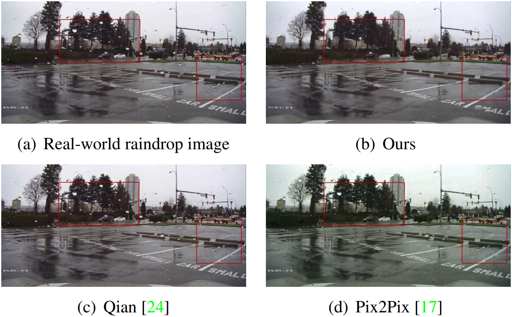
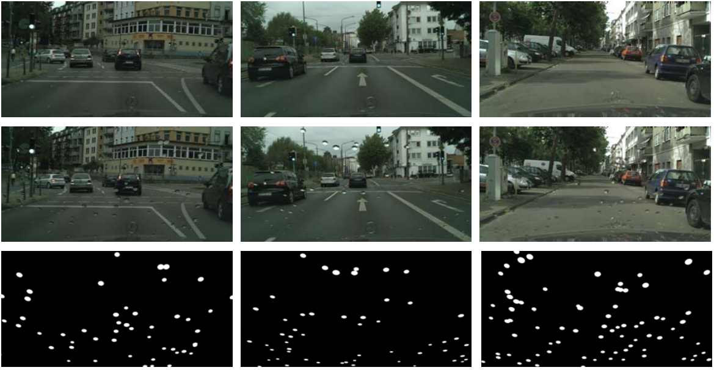
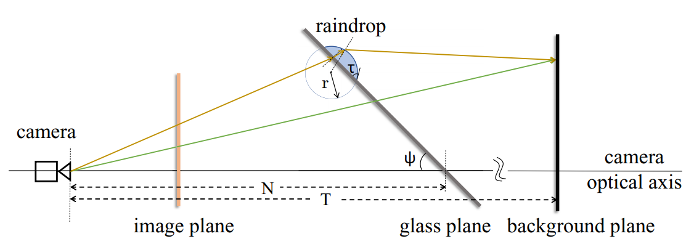
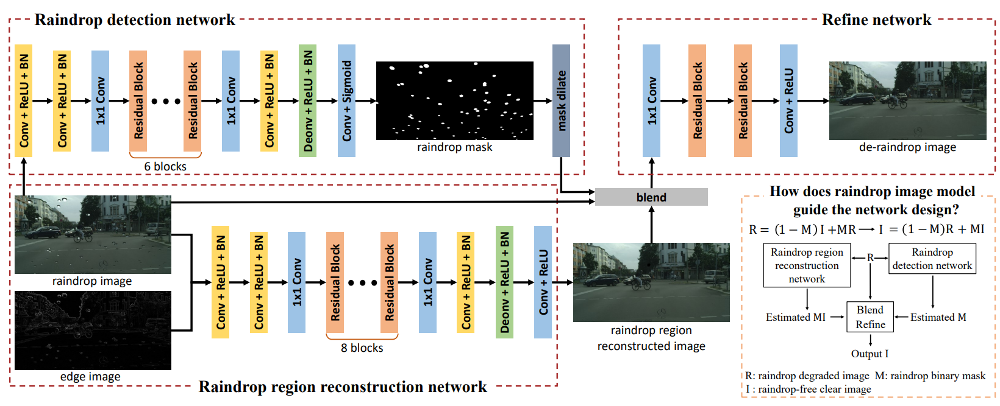

# Learning From Synthetic Photorealistic Raindrop for Single Image Raindrop Removal


we propose the first photo-realistic dataset of synthetic adherent raindrops with pixel-level mask for the  training of raindrop removal.

<div align=center>   </div>

**Picture:**  *Visual comparison of raindrop removal in real rainy scenes. Our method removes most of raindrops although the raindrops have large variety.*

## Data generation

We use c++ to generate the raindrop dataset.

<div align=center>   </div>

**Picture:**  *Samples of our synthetic raindrop images. Top: The ground truth clear image in Cityscapes dataset. Middle: The synthetic raindrop image produced by our refraction model. Bottom: The ground truth binary mask of the raindrops.*

<div align=center>   </div>

**Picture:**  *Refraction model.*

Please follow these steps to generate the synthetic dataset.

1. **Prepare the data.** Download the cityscapes dataset from their [website](https://www.cityscapes-dataset.com/). Only the RGB images are needed.

2. **Generate the images with raindrops.**  

   ```shell
   cd data_generation/makeRain/
   # Install libs in 3rdparty/ 
   # Specific the path of the cityscapes dataset in L19 of main.cpp
   # Specific the save path of your dataset in L41 of main.cpp
   mkdir build
   cd build
   cmake -DCMAKE_BUILD_TYPE=Release ..
   make -j8
   # Then run the executable file in the build/
   ```

3. **Generate the edge of the input image.** Similar to step 2, cd `data_generation/rainEdge` and run similar cmds.

## Train and test

<div align=center>   </div>

**Picture:**  *Refraction model. The light ray colored in green does not go through any raindrops. The light ray colored in yellow goes through a raindrop and is refracted twice.*

The training and test scripts can be found in the `removal/`

For instance, in training phase:

1. Train `ardcnn`
2. Train `icnn`
3. Train `combine`
4. Train `combine_fine`

The test phase is similar to the training phase.

## Citations

If you find this repo is useful to your work, please cite our paper

```tex
@inproceedings{hao2019learning,
  title={Learning from synthetic photorealistic raindrop for single image raindrop removal},
  author={Hao, Zhixiang and You, Shaodi and Li, Yu and Li, Kunming and Lu, Feng},
  booktitle={Proceedings of the IEEE/CVF International Conference on Computer Vision Workshops},
  pages={0--0},
  year={2019}
}
```


